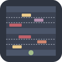
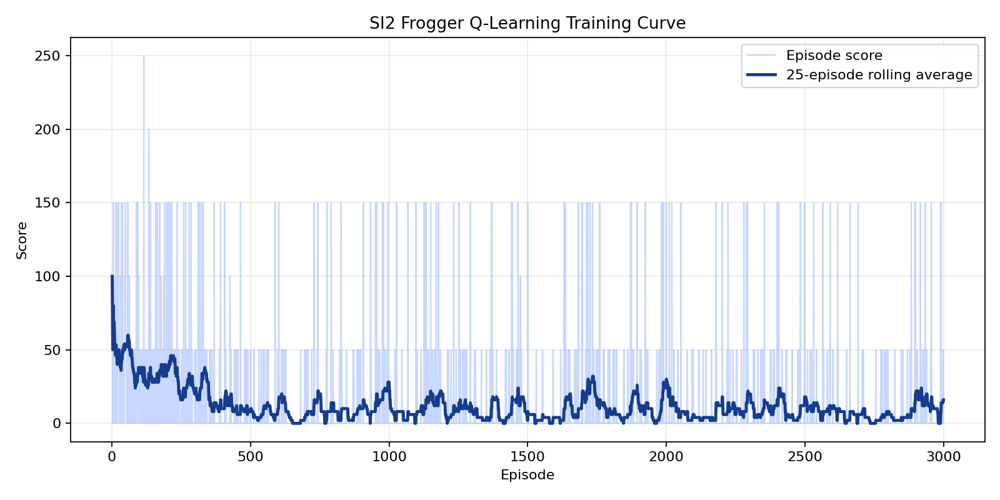

#  SI2 - Frogger Q-Learning Agent

This repository implements an autonomous agent for the **SI2 - Frogger** project. The game server and Canvas viewer are kept from the base project, and the agent layer now includes a trainable tabular Q-learning policy with a risk-aware safety filter.

The objective is to move the frog through traffic lanes, reach the middle checkpoint, reach the final checkpoint, and continue scoring laps while preserving lives.

## Features

- Real-time Python backend using the `ai-game-framework`.
- Web viewer served from `server/viewer/`.
- Manual terminal agent for debugging.
- Dummy random agent for baseline comparison.
- Q-learning agent with offline training and online WebSocket play.
- Reproducible model artifact at `models/q_table.json`.
- Unit tests for game logic and policy safety behavior.

## Setup

### 1. Prerequisites

- Python 3.10 or newer.

### 2. Create and Activate a Virtual Environment

```bash
python3 -m venv venv
source venv/bin/activate
```

### 3. Install Dependencies

```bash
pip install -r requirements.txt
```

## Running the Game

Start the backend server:

```bash
python3 -m server.server
```

By default the server listens on port `8765`. You can choose another port if `8765` is already in use:

```bash
python3 -m server.server --host 127.0.0.1 --port 8769
```

Open the viewer:

```text
http://localhost:8765/
```

If you use a custom port, open the same port in the browser, for example `http://localhost:8769/`.

Run the trained Q-learning agent in another terminal:

```bash
python3 -m agents.rl_agent
```

For a custom server port, pass the matching WebSocket URL:

```bash
python3 -m agents.rl_agent --server ws://127.0.0.1:8769/ws
```

Optional baseline agents:

```bash
python3 -m agents.dummy_agent
python3 -m agents.manual_agent
```

### Server and Viewer Runtime Notes

The server now sends real-time state frames to the connected agent during each running tick. Without this, the agent could connect and receive a player ID but never receive live game states, so it would not send movement actions.

The browser viewer now connects to the same port used by the page URL instead of always hardcoding `8765`. This keeps the viewer, server, and agent aligned when running on a custom port such as `8769`.

If the status says `RUNNING` but the frog is not moving:

- Make sure the server is running from the latest code.
- Make sure the agent is connected to the same port as the viewer.
- Hard refresh the browser after restarting the server.
- Stop stale processes if multiple servers are listening on the same port, then restart one clean server and one agent.

## Training

Train a new Q-table from local game simulations:

```bash
python3 -m agents.train_q_learning --episodes 3000 --output models/q_table.json
```

Useful parameters:

```bash
python3 -m agents.train_q_learning \
  --episodes 3000 \
  --alpha 0.15 \
  --gamma 0.95 \
  --epsilon 0.40 \
  --seed 7 \
  --output models/q_table.json
```

The trainer uses the same `server.logic.Frogger` rules as the live server. Each training step applies one action and advances several frames so the cooldown and moving cars are represented in the transition.

Training outputs are written to:

- `models/q_table.json`
- `results/training_log.csv`
- `results/training_curve.png`



The displayed curve was regenerated from the current 3000-episode training run with `alpha=0.15`, `gamma=0.95`, `epsilon=0.40`, and `seed=7`.

## Agent Architecture

### State Representation

The tabular policy compresses the JSON game state into:

| Feature | Description |
| :------ | :---------- |
| `frog_y` | Current lane/progress row. |
| `frog_x` | Rounded horizontal grid position. |
| `current_risk` | Collision risk in the current lane. |
| `north_risk` | Collision risk if moving north. |
| `phase_bias` | Checkpoint phase plus lateral bias toward safer neighboring cells. |

Obstacle risk is computed from car positions, widths, speeds, lane numbers, and short-horizon lookahead. Wrapped cars are handled so cars crossing the board edge still count as threats.

### Action Space

The agent can select:

- `NORTH`
- `SOUTH`
- `EAST`
- `WEST`

Legal actions are filtered by board bounds. A safety layer removes actions that would move directly into a predicted collision when a safer legal alternative exists.

### Model

The model is a dictionary-backed tabular Q-function:

```text
Q(encoded_state, action) -> expected return
```

This was chosen because the Frogger board is compact, the assignment state is already structured, and the approach remains easy to inspect and reproduce without a heavyweight deep-learning dependency.

## Reward Design

The reward combines game score with shaping:

| Event | Reward impact |
| :---- | ------------: |
| Score increase | `+score_delta` |
| Forward movement | `+2` |
| Reaching the middle checkpoint for the first time in a lap | `+50` |
| Completing a full lap | `+100` |
| Staying without lane progress for 5 or more steps | `-1` per step |
| Moving south | `-4` |
| Losing a life | `-150` |
| Game over | `-250` |

The score delta keeps the learned policy aligned with the game objective. The forward-progress bonus makes early exploration less sparse because the frog receives feedback before it completes a checkpoint. The middle-checkpoint bonus rewards reaching the first safe goal in each lap, and the full-lap bonus makes the final crossing more valuable than only farming partial progress. The stale-lane penalty discourages dithering in place when the agent repeatedly sidesteps without advancing. The life-loss and game-over penalties are intentionally large because one reckless action can erase an otherwise good run.

## Hyperparameter Selection

| Hyperparameter | Value | Reasoning |
| :------------- | ----: | :-------- |
| Learning rate `alpha` | `0.15` | Keeps Q-value updates steadier across a longer 3000-episode run while still adapting after sparse checkpoint rewards. |
| Discount factor `gamma` | `0.95` | Gives more weight to longer-term checkpoint and lap rewards, which helps the policy value progress beyond immediate lane survival. |
| Initial exploration `epsilon` | `0.40` | Encourages broader lane and sidestep exploration early in training, then decays exponentially to a small floor for late refinement. |
| Life-loss penalty | `-150` | Larger than a checkpoint reward so unsafe crossings are not attractive. |
| Game-over penalty | `-250` | Strong terminal penalty to protect remaining lives. |
| Progress/checkpoint shaping | `+2`, `+50`, `+100` | Balances dense movement feedback with larger milestone rewards for checkpoint and lap completion. |

## Evaluation

The checked-in model was generated with:

```bash
python3 -m agents.train_q_learning --episodes 3000 --alpha 0.15 --gamma 0.95 --epsilon 0.40 --seed 7 --output models/q_table.json --results-dir results
```

Training summary:

| Metric | Value |
| :----- | ----: |
| Episodes | 3000 |
| Seed | 7 |
| Learned states | 415 |
| Average final score | 12.02 |
| Best score during training | 210 |

Offline evaluation was run for 100 episodes per agent with randomized traffic phase offsets:

```bash
python3 -m agents.evaluate_agents --episodes 100 --model models/q_table.json --output results/evaluation_log.csv --seed 11 --max-warmup-frames 90
```

Latest evaluation output:

| Agent | Average score | Best score | Average high score | Best high score | Episodes reaching mid-checkpoint | Episodes completing a lap |
| :---- | ------------: | ---------: | -----------------: | --------------: | -------------------------------: | ------------------------: |
| Q-learning agent | 155.5 | 350 | 172.9 | 380 | 100.0% | 64.0% |
| Dummy random agent | 0.5 | 50 | 16.6 | 50 | 1.0% | 0.0% |

Fixed-phase evaluation with `--max-warmup-frames 0` repeats the same initial traffic layout every episode and can overstate policy robustness. With the current model it scores `300.0` average over 100 identical-phase episodes, while the randomized traffic-phase evaluation above is the reported robustness metric.

The Q-learning policy is stronger than the random baseline, but the varied-phase evaluation shows that it is not uniformly stable across all traffic timings. The training curve remains noisy because many exploratory training episodes still end with low or zero final score.

## Tests

Run the test suite:

```bash
python3 -m unittest discover -s tests
```

Latest test result:

```text
Ran 13 tests in 0.001s
OK
```

Current tests cover:

- Initial game state.
- Movement bounds.
- Collision handling.
- Checkpoint and score behavior.
- High-score tracking.
- Q-learning policy safety decisions.
- Training hyperparameter defaults.
- Evaluation warmup and progress metadata.

## Repository Structure

```text
agents/
  base_agent.py          Shared WebSocket client loop.
  dummy_agent.py         Random baseline.
  manual_agent.py        Terminal WASD control.
  rl_agent.py            Online Q-learning agent and policy.
  train_q_learning.py    Offline Q-learning trainer.
  evaluate_agents.py     Offline 100-episode agent comparison.
models/
  q_table.json           Trained tabular model.
results/
  training_curve.png     Training score plot.
  training_log.csv       Per-episode training stats.
  evaluation_log.csv     Per-episode evaluation stats.
  evaluation_summary.csv Aggregated evaluation table.
server/
  logic.py               Frogger simulation.
  server.py              AI game framework integration.
  viewer/                Browser-based Canvas UI.
tests/
  test_logic.py          Game and policy tests.

```
